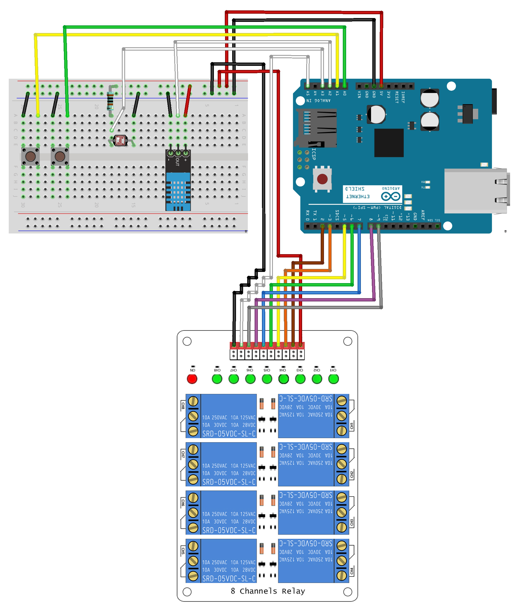

# **Arduino Sketch**

Código que disponibiliza uma REST API para controlar e monitorar os diversos _relays_ e sensores.

### Esquema:

### Partes:
- Arduino Uno v3.
- Arduino W5100 Ethernet Shield.
- 8 Channels Relay Module.
- Sensor DHT11.
- Sensor LDR.
- Resistor de 1K ohms.
- 2 Botões _pull-up_.
- Cabos (_jumpers_).

### Instruções:
1. Copie a pasta `"libraries/DHT11"` [manualmente][1] para a _library_ do seu **Arduino Software (IDE)**.
2. Conecte seu **Arduino** ao computador, identificando e selecionando sua porta de comunicação.
3. Faça o _upload_ do _sketch_ que está na pasta `"INFNETGADSTCC"`.

[1]: (https://www.arduino.cc/en/Guide/Libraries)