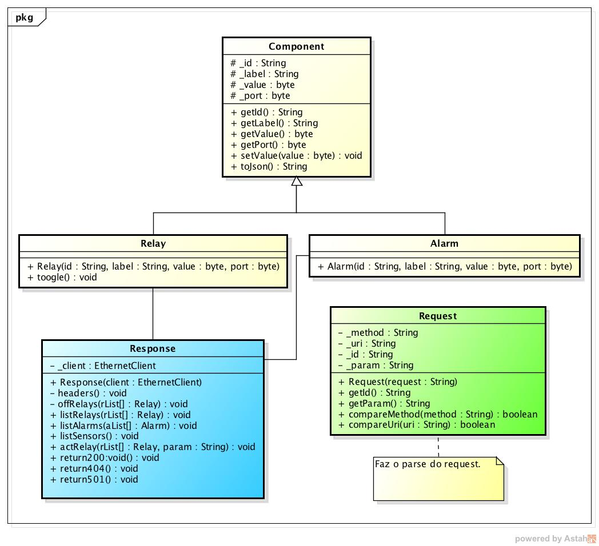
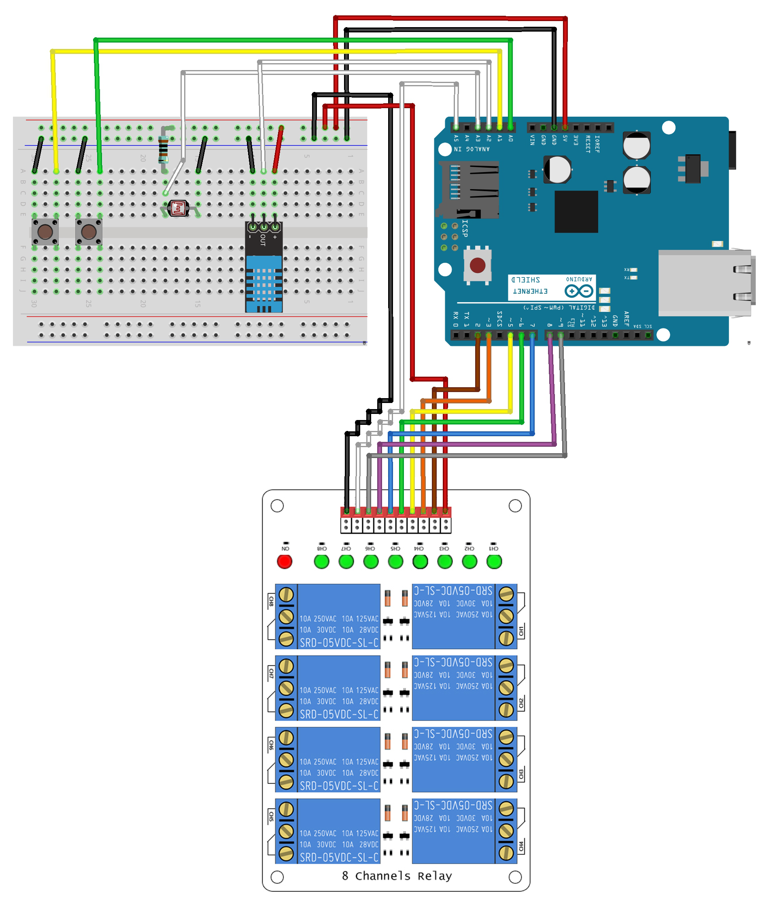

# Instituto INFNET

## TCC - Domótica com Arduino

### Arduino Sketch

Código que disponibiliza uma *REST API* para controlar e monitorar os diversos *relays* e sensores.

---

### ✏️ Diagrama de classe



---

### 📋 Esquemas



---

### 📦 Partes

- Arduino Uno v3.
- Arduino W5100 Ethernet Shield.
- 8 Channels Relay Module.
- Sensor DHT11.
- Sensor LDR.
- Resistor de 1K ohms.
- 2 Botões *pull-up*.
- Cabos (*jumpers*).

---

### 📝 Instruções

1. Copie a pasta ```"libraries/DHT11"``` manualmente] para a *library* do seu [Arduino Software (IDE)][1].
2. Conecte seu **Arduino** ao computador, identificando e selecionando sua porta de comunicação.
3. Faça o *upload* do *sketch* que está na pasta ```"INFNETGADSTCC"```.

[1]: (https://www.arduino.cc/en/Guide/Libraries)