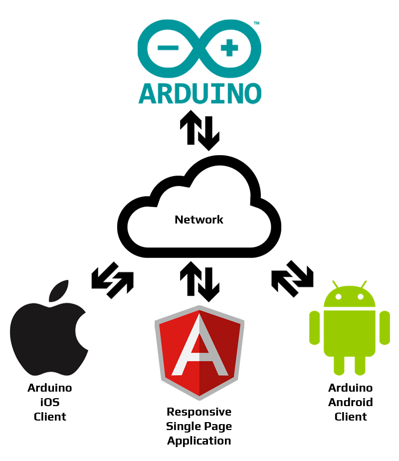

# Instituto INFNET

## TCC - Domótica com Arduino

Este trabalho teve como objetivo a criação de um pequeno projeto de automação residencial de baixo custo, com a utilização de tecnologias *open source* e a demonstração da integração entre os seus diversos sistemas. Na construção física do projeto, foi utilizada a plataforma de prototipação eletrônica **Arduino**, que possui diversos *shields*, módulos e sensores de baixo custo, o que possibilitou reduzir drasticamente o seu custo total. Para a comunicação com o **Arduino** foram desenvolvidos softwares na forma de um *Single Page Application* (SPA) e aplicativos para as plataformas móveis **Android** e **iOS**, com a utilização dos frameworks AngularJS, Ionic e Cordova. O **Arduino** fica ligado à rede local da residência através de uma conexão *ethernet*, disponibilizando um *web service* que responde às requisições *HTTP* através da sua *REST API*.

---

### ⚙️ Sistemas

- [Arduino (Sketch)](arduino-sketch)
- [Single Page Application (AngularJS)](angular-project)
- [Mobile Apps (Ionic Framework)](ionic-project)

---

### 📚 Referências

- [Arduino](https://www.arduino.cc/en/tutorial/sketch)
- [AngularJS](https://angularjs.org/)
- [Ionic Framework](https://ionicframework.com/)
- [Postman](https://chrome.google.com/webstore/detail/postman/fhbjgbiflinjbdggehcddcbncdddomop)
