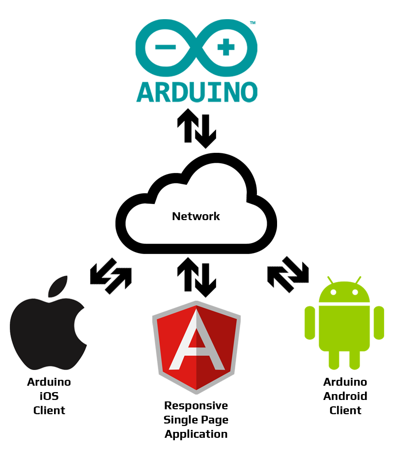

# Instituto INFNET :: Trabalho de Conclusão de Curso
---

## **Domótica com Arduino**

Este trabalho teve como objetivo a criação de um pequeno projeto de automação residencial de baixo custo, com a utilização de tecnologias _open source_ e a demonstração da integração entre os seus diversos sistemas. Na construção física do projeto, foi utilizada a plataforma de prototipação eletrônica **Arduino**, que possui diversos _shields_, módulos e sensores de baixo custo, o que possibilitou reduzir drasticamente o seu custo total. Para a comunicação com o **Arduino** foram desenvolvidos softwares na forma de um _Single Page Application_ (SPA) e aplicativos para as plataformas móveis **Android** e **iOS**, com a utilização dos frameworks Angular, Ionic e Cordova. O **Arduino** fica ligado à rede local da residência através de uma conexão _ethernet_, disponibilizando um _web service_ que responde às requisições _Hypertext Transfer Protocol_ (HTTP) através da sua _Representational State Transfer_ (REST) _Application Programming Interface_ (API).

### Sistemas:
- ##### [Arduino Sketch ](ArduinoSketch)
- ##### [Single Page Application](SPA)
- ##### [Ionic Mobile Apps](ionic-project)

### REST API:
Para testar a REST API, foi criada uma coleção de _requests_ no [Postman](Postman).

---
### Links:
- [Node.js](https://nodejs.org/en/)
- [AngularJS](https://angularjs.org/)
- [ionic](https://ionicframework.com/)
- [Postman](https://chrome.google.com/webstore/detail/postman/fhbjgbiflinjbdggehcddcbncdddomop)