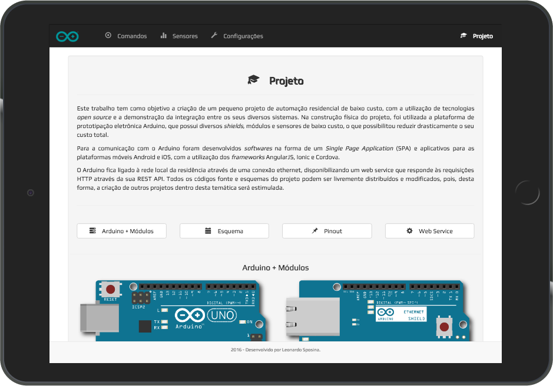

# **_Single Page Application_ (SPA)**

Código que disponibiliza um _Single Page Application_, que pode ser acessado por qualquer dispositivo que possua um _web browser_ com JavaScript habilitado.

### Aplicativo:



### Instruções:

1. Abra o terminal e navegue até a pasta do **SPA**.
2. Instale as dependências através do comando abaixo:
    ```sh
    $ npm install
    ```
3. Aproveitando o ambiente Node.js, instale globalmente um [servidor HTTP][1] com o comando a seguir:
    ```sh
    $ npm install http-server -g
    ```
4. Ainda dentro da pasta do SPA, execute o servidor HTTP com o seguinte comando:
    ```sh
    $ http-server -o
    ```

[1]:(https://www.npmjs.com/package/http-server)