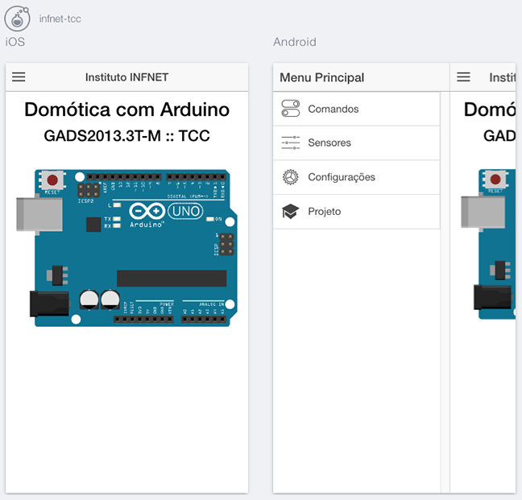
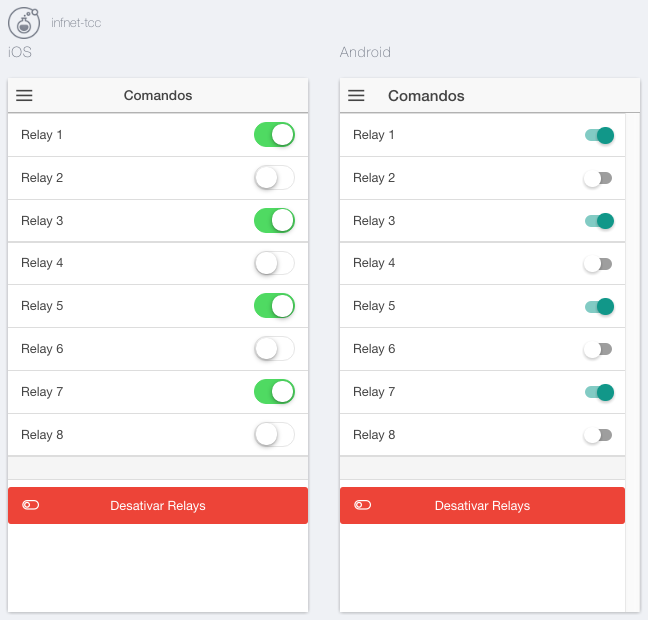
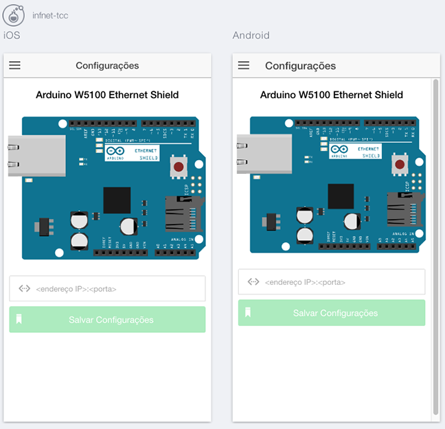

# Instituto INFNET

## TCC - Domótica com Arduino

### Ionic Mobile Apps (Android e iOS)

Código para gerar os aplicativos híbridos para as plataformas móveis **Android** e **iOS**.

---

### ⚙️ Aplicativos





---

### 📝 Instruções

1. Abra o terminal e navegue até a pasta do projeto **Ionic**.
2. Instale os pacotes `Ionic` e `Cordova` através do seguinte comando:

    ```sh
    npm install ionic cordova -g
    ```

3. Instale as dependências do projeto com o comando a seguir:

    ```sh
    npm install
    ```

4. Instale o suporte à plataforma **Android**:

    ```sh
    ionic platform add android
    ```

5. Construa seu aplicativo híbrido para a plataforma **Android**:

    ```sh
    ionic build android --release
    ```

    O aplicativo será gerado na pasta `"ionic-project/platforms/android/build/outputs/apk"`

6. Instale o suporte à plataforma **iOS**: (apenas para quem utiliza *macOS*)

    ```sh
    ionic platform add ios
    ```

7. Construa seu aplicativo híbrido para a plataforma **iOS**: (apenas para quem utiliza *macOS*)

    ```sh
    $ionic build ios --release
    ```

    O arquivo `infnet-tcc.xcodeproj` será gerado na pasta `"ionic-project/platforms/ios"`, e deverá ser aberto no **Xcode** para compilação.
